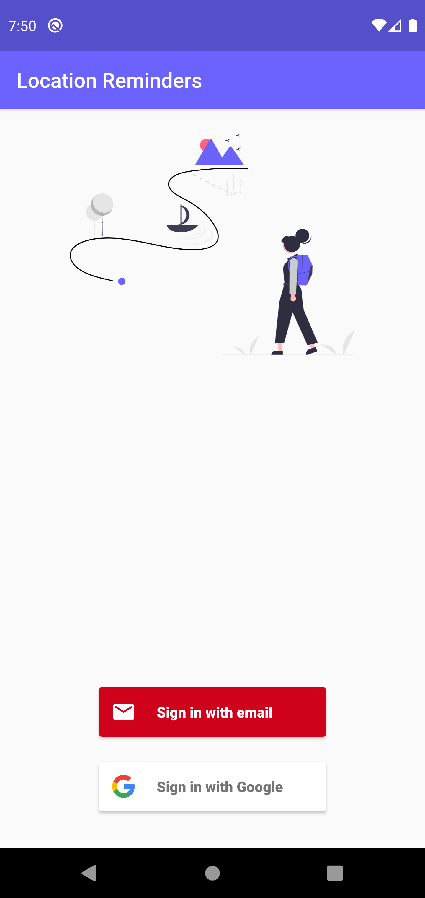
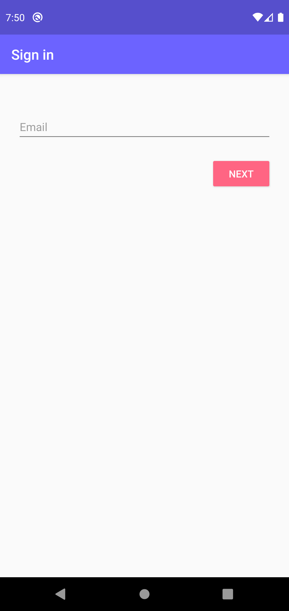
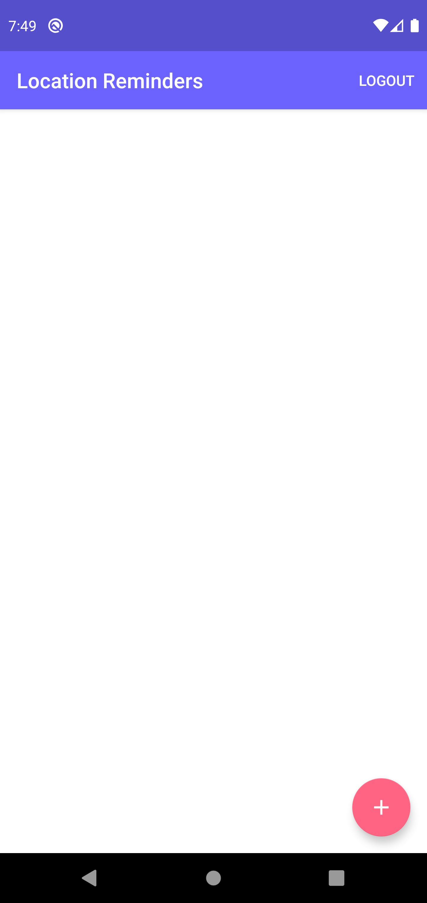
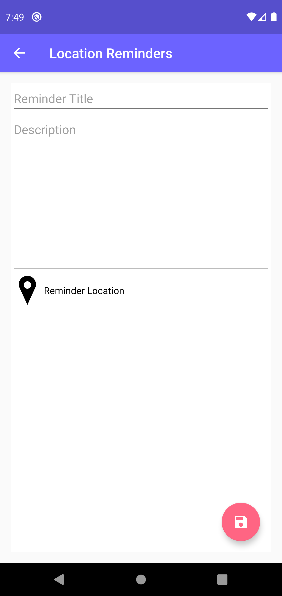
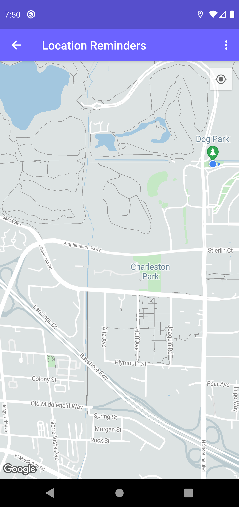
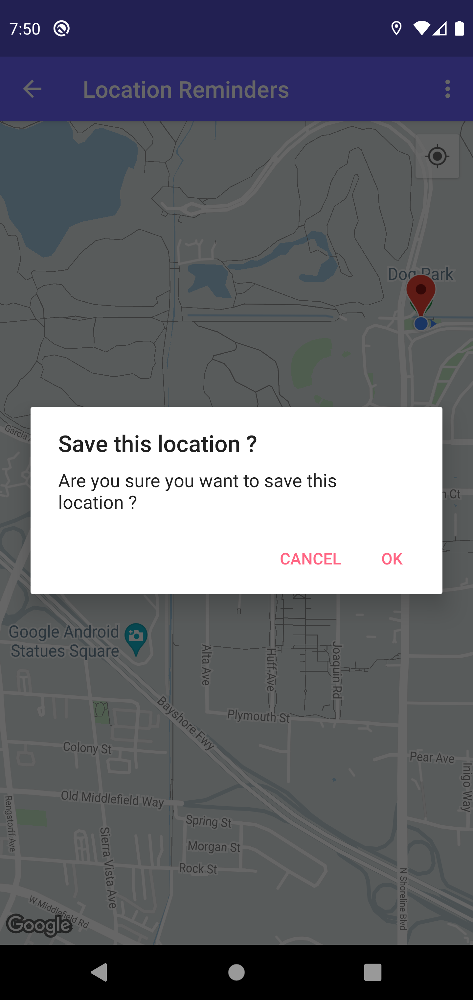
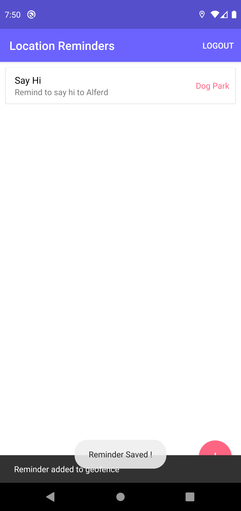

## Maps Location Reminder

Maps location reminder is an Android application that helps you to save a location reminder. 
Once the user reaches the geo-location of the saved reminder a notification is showed to the user.

The app follows the clean-architecture approach and uses the latest android library including the Android jetpack.

## Screens
	
	
	
	

## Setting up the Repository

To get started with this project, simply pull the repository and import the project into Android Studio. From there, deploy the project to an emulator or device. 

* NOTE: In order for this project to pull data, you will need to add your API Key to the project for the maps to run. You can generate an API Key from the [Google Developers Console]

## Report Issues

Notice any issues with a repository? Please file a github issue in the repository.

License
=======

    Licensed under the Apache License, Version 2.0 (the "License");
    you may not use this file except in compliance with the License.
    You may obtain a copy of the License at

       http://www.apache.org/licenses/LICENSE-2.0

    Unless required by applicable law or agreed to in writing, software
    distributed under the License is distributed on an "AS IS" BASIS,
    WITHOUT WARRANTIES OR CONDITIONS OF ANY KIND, either express or implied.
    See the License for the specific language governing permissions and
    limitations under the License.
